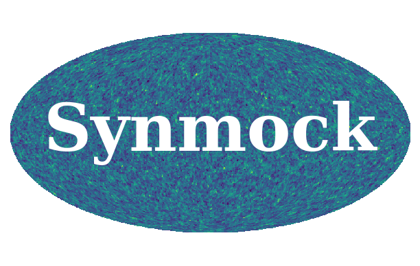

# Synmock



Generate random log-normal realizations of galaxy catalogs

Author: Ben Granett

Installation
------------

Dependencies: CLASS is called to generate the model power spectrum (https://github.com/lesgourg/class_public/). Numpy, scipy, pandas, healpy and pyaml are also required.

The command line program may be installed by running the setup file:
  python setup.py install

Examples
--------

A command line executable is installed called `synmock`

* Generate a catalog in a cube with side length 2048 Mpc/h

```sh
  synmock --box 2048 --cellsize 8 --nbar 1e-3 --nreal 1 --out lncat.txt
```

* Generate a catalog projected on the sky with an angular mask and radial selection function. The observer is put at the center of the box.

```sh
  synmock --nofz cmass_nofz.txt --mask cmass_mask.txt --box 4096 --cellsize 16 --nreal 1 --out lncat.txt
```
